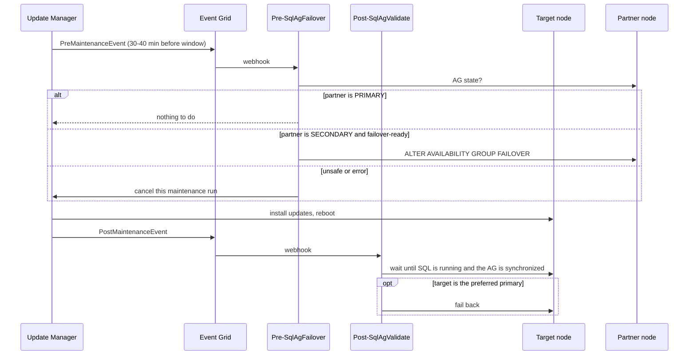

# How AG-aware patching works

SQL-VM-1 and SQL-VM-2 are patched by Azure Update Manager, one node at a time. Runbooks move the availability group (`ag-sql-ha`) off a node before it is patched, so the primary is never rebooted.

For patching hundreds of instances, see [SCALING.md](SCALING.md).

## Components

| Component | Name | Role |
|-----------|------|------|
| Maintenance configurations | `sql-update-wave1` (SQL-VM-1), `sql-update-wave2` (SQL-VM-2); default names are `mc-sqlag-<node>` | One schedule per node, so the nodes never patch at the same time. Their tags name the target node, its AG partner, the AG and the preferred primary |
| Event Grid system topics | `st-<configuration>` | Forward each configuration's pre- and post-maintenance events |
| Automation webhooks | `wh-pre-sqlag-failover`, `wh-post-sqlag-validate` | Start the runbooks when an event arrives |
| Runbooks | `Pre-SqlAgFailover`, `Post-SqlAgValidate` | Read and change the AG state with the Arc SQL availability group API (ARM only; see below) |
| Automation account | `aa-sql-ag-patching` | Its managed identity has *Contributor* on each Arc SQL instance (AG API) and on each configuration (cancel a run) |

All resources are in `rg-dxc-test-sql-vm-ha-arc`.

## Schedule (default)

Every Saturday, Pacific time:

| Wave | Node | Pre-event | Window | Post-event |
|------|------|-----------|--------|------------|
| 1 | SQL-VM-2 | ~00:20-00:30 | 01:00-03:00 | when patching ends |
| 2 | SQL-VM-1 | ~03:50-04:00 | 04:30-06:30 | when patching ends |

The 90-minute gap gives wave 1's node time to reboot and resynchronize before wave 2's pre-event fires.

## One wave, step by step



1. **Pre-event.** `Pre-SqlAgFailover` reads the partner's AG role.
   - If the partner is already primary, the target is a secondary and is safe to patch.
   - If the partner is a synchronous secondary and every database is failover-ready, the runbook does a planned failover to it with no data loss. If the partner is still catching up, the runbook waits up to 10 minutes first.
   - Otherwise it **cancels the maintenance run**. This happens when the partner is offline or not synchronized, the failover fails, or too little time is left before the cancellation cut-off. The node is then skipped for that week.
2. **Window.** Update Manager installs Windows updates and SQL Server CUs (Microsoft Update is enabled on the nodes). It reboots the node if required.
3. **Post-event.** `Post-SqlAgValidate` waits up to 45 minutes for the Arc SQL extension to report the replica connected, healthy and synchronized, then logs the SQL build. If the target is the preferred primary (SQL-VM-1), it fails the AG back to it. If the node does not become healthy, the job fails. The next wave's pre-event then sees an unhealthy partner and cancels that wave.

With SQL-VM-1 as primary, a normal week has two failovers:

| Step | Wave 1 (SQL-VM-2) | Wave 2 (SQL-VM-1) |
|------|-------------------|-------------------|
| Pre | none (SQL-VM-2 is already a secondary) | fail over to SQL-VM-2 |
| Patch | SQL-VM-2 | SQL-VM-1 |
| Post | validate | validate, fail back to SQL-VM-1 |

## How the runbooks talk to SQL Server

The runbooks call only ARM, using the availability group API of SQL Server enabled by Azure Arc (GA, `2024-01-01` and `2026-01-01`). This is the same API the portal's *Availability Groups* blade uses. The Arc SQL extension runs the request on the host with its own SQL permissions, so there's no Run Command, T-SQL or extra SQL login.

| Call | Used for |
|------|----------|
| `POST .../sqlServerInstances/{instance}/availabilityGroups/{ag}/getDetailView` | Live AG state: replica role, availability mode, connected state and sync health, plus per-database sync state. `collectionTimestamp` shows when the data was collected; the runbooks reject data older than 60 seconds. |
| `POST .../sqlServerInstances/{target}/availabilityGroups/{ag}/failover` | Planned failover **to** `{target}`, which must be a synchronized synchronous-commit secondary. |

Things to know:

- **Failover** currently returns HTTP 400 `Failover retrieve null resource`, even when it succeeds (tested on both API versions). The runbooks treat this response as expected and confirm the new primary with `getDetailView`. The failover takes about 10 seconds.
- **A secondary** reports only its own replica and databases. A primary reports all of them.
- **Failover-ready** means a healthy, connected, synchronous-commit secondary whose databases are all `SYNCHRONIZED`. SQL Server itself still refuses the failover if a database isn't ready.

## Node settings

`Set-WindowsUpdatePolicy.ps1` registers the nodes with Microsoft Update, so SQL Server CUs are offered. It also sets Windows Update to notify only (`AUOptions=2`), so Windows never installs updates or reboots on its own. The original values are saved under `HKLM:\SOFTWARE\SqlAgPatching`.

## Operate

```powershell
.\scripts\patching\Enable-SqlAgPatching.ps1                   # create or update (safe to rerun)
.\scripts\patching\Enable-SqlAgPatching.ps1 -RotateWebhooks   # before the webhooks expire (365 days)
.\scripts\patching\Disable-SqlAgPatching.ps1 -RemoveWindowsUpdatePolicy
```

Common options for `Enable-SqlAgPatching.ps1`: `-RecurEvery 'Month Second Saturday'`, `-StartTime`, `-WindowDuration` (01:30-03:55), `-GapMinutes`, `-PreferredPrimary`, `-ExcludeKbs`, `-FirstNode`/`-SecondNode`, `-ConfigNames` (names for wave 1 and wave 2; the AG's configurations with other names are replaced, because Azure can't rename a configuration).

This environment was set up with:

```powershell
.\scripts\patching\Enable-SqlAgPatching.ps1 -FirstNode SQL-VM-1 -SecondNode SQL-VM-2 -ConfigNames sql-update-wave1,sql-update-wave2 `
    -RecurEvery 1Day -StartTime 14:30 -GapMinutes 90
```

| To check | Where |
|----------|-------|
| Runbook output | Automation account `aa-sql-ag-patching` > Jobs |
| Patch results | Azure Update Manager > History, or each Arc machine > Updates |
| AG state | SSMS > Always On High Availability dashboard |

## Caveats

- **Don't use other schedules on these nodes.** Keep automatic updates off in *SQL Server - Azure Arc > Updates*, and keep the nodes out of other Update Manager schedules. Those patch both nodes at once. The setup script removes such assignments, but it does not check dynamic-scope (filter-based) schedules.
- **A failed pre-event doesn't stop patching.** If the webhook has expired or Automation is unavailable, Update Manager still patches the node, without a failover.
- **There is a gap between the failover and the patch.** The failover happens 30-40 minutes before the window. If the new primary fails in that time, the AG can fail back automatically to the node about to be patched.
- **Runbooks must be idempotent.** Event Grid can deliver an event more than once. A repeated pre-event finds the partner already primary and does nothing.
